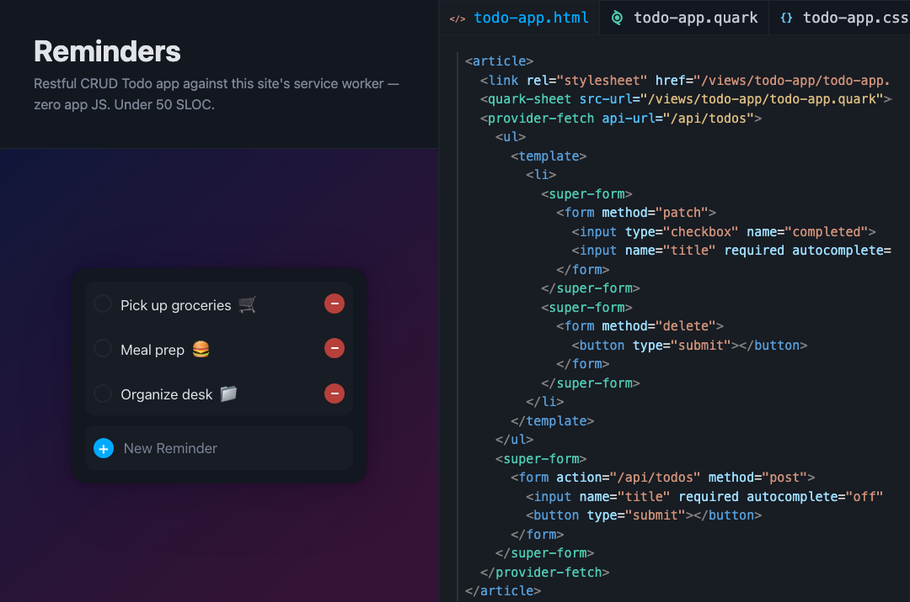

<p align="center"></p>

# Nucleus Stack

Rich HTML apps - implementing the novel [ASO architectural pattern](https://excom.dev/nucleus/docs/adapter_state_orchestrator).

- **Docs:** https://excom.dev/nucleus
- **For LLMs / agents:** [llms.txt](https://excom.dev/llms.txt) (index) and [llms-full.txt](https://excom.dev/llms-full.txt) (everything); per-page markdown at `https://excom.dev/docs/<guide>.md` and `https://excom.dev/<element>.md`
- **Contributing:** [CONTRIBUTING.md](packages/docs-site/support/docs/CONTRIBUTING.md)

Your HTML __*is*__ the app! Drop-in custom elements that each have a single responsibility, then author CSS-derived rules that observe the page and react accordingly. The source of truth - your HTML - is what the browser paints.

**No components, no virtual DOM, no second copy of application state tucked away in JS memory, and no build process.**

[Live demo](https://excom.dev/nucleus/examples/todos): fully RESTful Todo app - under 50 lines of code, zero app JS, no build process.

[](https://excom.dev/nucleus/examples/todos)

## How it's different from existing UI solutions

- **Back to the future** Welcome back to building static HTML5 apps. A break from complex JavaScript apps that compile to HTML.
- **Little to no JavaScript** You no longer need to write JS for the vast majority of UI cases. You may still call-out to your own pure functions for complex cases.
- **Native++** Just HTML with a derivative of CSS, named Quark, sprinkled on top.
- **No magic** No special frameworks, build processes, rendering wizardry, or "HTML-in-my-JS" / "JS-in-my-HTML" DSLs.
- **Progressively enhanced** Drop into existing static/server-side-rendered sites. Neutron and Quark can also be used independently.
- **Fully composable** Templates, templating, behavior, and custom logic are all decoupled & robust.
- **Reactive State Machine** A simple, reliable, declarative syntax for your business logic - Quark.
- **No reconciliation tax** No large memory copies of state/DOM to be rebuilt, diffed against the DOM, recompiled with every state change.
- **Lightweight** All Nucleus Kit elements + Quark + Neutron have a smaller footprint (just over ~50kb compressed) than some UI framework cores alone.

## What's in the stack

- **Nucleus Kit elements** A growing catalog of drop-in custom elements, including: drawers, tabs, tables, lazy views, forms, routing, passkeys, data fetching, and more.
- **Quark** Like CSS, for document mutation. Select elements, bind data, stamp lists, wire events, and drive state transitions with simple rules instead of imperative code.
- **Valence.css** Semantic, classless CSS that caters to both native and custom elements, with themes, light/dark schemes, and design tokens. Designed for easy drop-in. Optional.
- **Neutron** The small JS factory used to author the elements above. Reach for it only when the Nucleus Kit catalog lacks what you need. Optional.

Every piece stands alone. Use one element on an existing site, or compose the whole stack into a full single-page app. `nucleus-kit` bundles it all behind one import; if you find you only use a handful of elements, install those packages à la carte instead (`@excom/content-drawer`, `@excom/quark-sheet`, …) and skip the rest.

## Packages

Every package in `packages/` is published to npm under the `@excom` scope. The whole stack is one install:

```bash
npm install @excom/nucleus-kit
```

Then `import "@excom/nucleus-kit"` and `@import "@excom/nucleus-kit/basic.css"`. No package manager? Load both from unpkg - see [Quick Start](https://excom.dev/nucleus/docs/quick_start).

## Why teams pick it

- **Significantly less app code** This is possible for two primary reasons. First, because Nucleus Kit elements are fully composable, configurable, and controllable, they will likely be compatible with the desired experience of most applications that use them; there is a low likelihood you will need to build your own. Secondly, Quark enables the majority of customization without needing to invite JavaScript.
- **No components** There is no "component" concept in this architecture. This allows application pieces to be maximally reusable and composable, as there is no home to entrap logic with a tightly coupled view.
- **One source of truth** Live markup _is_ the primary application state, so an entire family of bugs ("the UI disagrees with the model") cannot exist.
- **Fully inspectable** Open devtools and the entire application is in front of you: every value, every binding, and every transition. The state is the document/DOM, so all is plainly transparent to see, alter, and debug in your inspector.
- **Accessible by default** Declarative & ARIA state is the state... not a mirror someone forgot to update.
- **Human and machine friendly** Inspect [the docs site](https://excom.dev/nucleus) to see its declarativeness. No more `<div>` soups bound to untraceable JavaScript. Custom elements make for a beautifully declarative document. A page that is legible, addressable, and serializable is an ideal target for code generation, AI-assisted editing, and confident human auditing. Tools reason about the screen's exact state instead of inferring a component tree. Likewise, writing and debugging UI code by hand has never felt simpler.
- **Declarative business behavior** The vast majority of your proprietary behaviors exist as simple configurations, rather than buried inside imperative spaghetti code.

## Where it shines

Content-rich sites, complex data-driven business rules, progressive enhancement of static/server-rendered pages, embedded user experiences. See [Limitations](https://excom.dev/nucleus/docs/limitations) for the edges.

The Nucleus Stack also opens up novel possibilities that were not easily served by any UI technology before: zero-build-tool UIs (e.g. on-the-fly generation), declarative & auditable target for LLM UI building, plain text assembly to rich UX (like a CMS), incremental upgrading of static/legacy SSR sites, resource-constrained web UIs (especially where scripting needs to be validated or limited, like an ATM), embedded UX (such as upgrading markdown with embedded functionality).

## Dogfood is nutritious

[The docs site](https://excom.dev/nucleus) - including the complex bits, like the text editors - was built entirely using this UI stack alone. Due to the declarative design of these technologies, inspecting the document will give you a very strong understanding of the application's composition and features. Open your inspector! Installing [Nucleus DevTools](https://excom.dev/nucleus/packages/nucleus-devtools) will also provide even stronger insight.

The Nucleus Stack is currently being used in production by partnering companies.

## Free & open source

The Nucleus Stack is MIT licensed and will remain free and open source. This is made possible by its contributors and sponsors. [Sponsor](https://github.com/sponsors/excom-dev) · [Contribute](packages/docs-site/support/docs/CONTRIBUTING.md)

## Start here

1. [Quick Start](https://excom.dev/nucleus/docs/quick_start) A working page, in five minutes.
2. [Core Concepts](https://excom.dev/nucleus/docs/core_concepts) The mental model, in one sitting.
3. [Using Elements](https://excom.dev/nucleus/docs/using_elements) and [Orchestrating](https://excom.dev/nucleus/docs/orchestrating) The two skills you'll use daily.
4. [Diving Deeper](https://excom.dev/nucleus/docs/diving_deeper) The architecture behind it all, for the curious and the skeptical.
